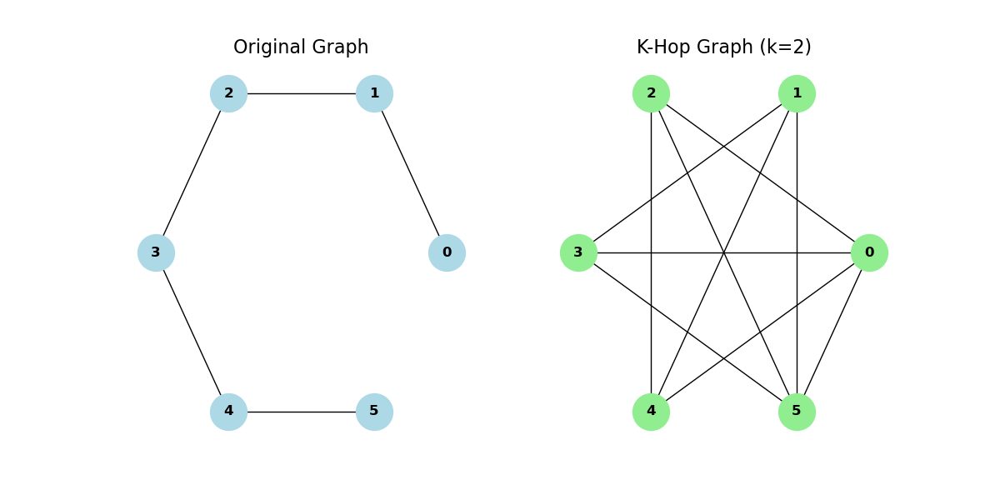
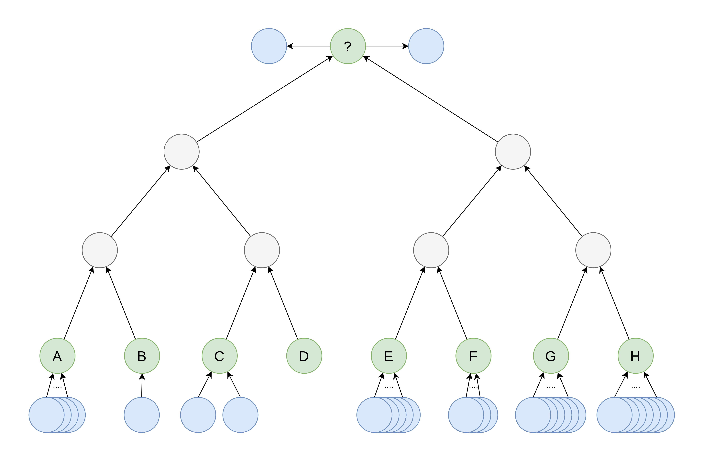

# Selective Long Range Connection GNNs
This repository contains the code for my seminar papar "Enhancing Message Passing Neural Networks with Selective Long-Range Connections to Mitigate Over-Squashing"

## Usage
To run the code, you need to install the requirements first. This can be done by running
```bash
conda env create -f environment.yml
conda activate slrc-gnn
```
Then, you can run the code by running
```bash
python main.py
```

To configure the experiment, you can change the parameters in the call of `main.py`. The following parameters are available:
```bash
main.py [-h] [--type {GCN,GGNN,GIN,GAT}] [--max_epochs MAX_EPOCHS] [--depth DEPTH] [--last_layer {REGULAR,FULLY_ADJACENT,K_HOP}] [--max_samples MAX_SAMPLES]
               [--learning_rate LEARNING_RATE] [--stop {TRAIN,TEST}]

options:
  -h, --help            show this help message and exit
  --type {GCN,GGNN,GIN,GAT}
                        GNN type to use
  --max_epochs MAX_EPOCHS
                        Maximum number of epochs
  --depth DEPTH         Depth of trees from NeighborsMatch dataset
  --last_layer {REGULAR,FULLY_ADJACENT,K_HOP}
                        Last layer type
  --max_samples MAX_SAMPLES
                        Maximum number of samples to use from NeighborsMatch dataset
  --learning_rate LEARNING_RATE
                        Learning rate
  --stop {TRAIN,TEST}   Stop criterion
```

## Idea
The project addresses the issue of over-squashing in processing large-scale graph data by establishing selective long-range connections in the network's final layer. This approach balances global information flow and local feature distinctiveness, improving MPNNs’ applicability and accuracy in complex scenarios. The selective long-range connections are chosen by a distance measure between nodes. The distance measure is based on the shortest path between nodes in the graph.

For the path graph with 6 nodes, the transformation would look like the following:

<p align="center">
  
</p>

## Datasets
In order to underline the effectiveness of the proposed approach, the experiments are conducted on the several datasets.

### TreeNeighborsMatch
TreeNeighborsMatch is a synthetic dataset generated by starting with a binary tree with a given depth. Next, for every leaf node a distinct number of (blue) neighbors is added. Finally, one of the distinct numbers of neighbors is chosen as the target and the same number of (blue) neighbors is added to the root node. The task is to predict the leaf node with the same number of neighbors as the root node.

<p align="center">
  
</p>

#### Results
The task as described was solved by Uri Alon and Eran Yahav in their paper "On the Bottleneck of Graph Neural Networks and its Practical Implications". They applied different GNNs to the dataset and compared the results. The following table shows the results achieved by them compared with the results we achieved with our novel approach on the dataset with a depth of 4:

| Model | Baseline | Our Approach |
| --- | --- | --- |
| GCN | 0.70 | **0.9921** |
| GIN | 0.77 | **0.9991** |


### ZINC
ZINC is a dataset of chemical compounds. The task is to predict the solubility of the compounds. The dataset is provided by the ZINC database and contains 250,000 compounds. Because of the large size of the dataset, only a subset of the dataset is used, a selection of 12,000 compounds.

#### Results
As the ZINC dataset presents a task that primarily requires local neighborhood aggregation, the results of the experiments on the dataset are not significant, as can be expected. The following table shows the results (MSE) achieved by the different GNNs on the dataset:

| Baseline | Our Approach |
| --- | --- |
| **0.2796 +/- 0.0634** | 0.2851 +/- 0.0878 |


### QM9
QM9 is a dataset of organic molecules. The task is to predict the atomization energy of the molecules. The dataset is provided by the QM9 database and contains 133,885 compounds. 


#### Results
QM9 presents a different molecular task than ZINC, as it requires global information flow. The results of the experiments on the dataset are vast improvements. The following table shows the results (MAE) achieved by the different GNNs on the dataset:

| Baseline | Our Approach |
| --- | --- |
| 66.965 +/- 0.5691 | **52.617 +/- 2.2848** |

The raw training results of the experiments can be found in the `results` folder. For a detailed analysis of the results, please refer to the seminar paper in the file `seminar-paper.pdf`. 


## References
The code is based on the following paper:
```
@inproceedings{alon2021on,
    title={On the Bottleneck of Graph Neural Networks and its Practical Implications},
    author={Uri Alon and Eran Yahav},
    booktitle={International Conference on Learning Representations},
    year={2021},
    url={https://openreview.net/forum?id=i80OPhOCVH2}
}
```
